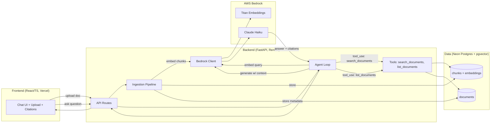

# High-Level Design: QAssist

## Problem

Teams accumulate documents — PDFs, policies, reports, contracts — faster than anyone can read them. Answering a specific question ("what's the termination clause say about notice period?") means opening multiple files and skimming, and the answer is trusted only as far as the reader's own skimming was careful. Generic chat models can't help because they don't have the documents, and pasting long documents into a chat window loses page-level provenance and doesn't scale past a handful of files.

QAssist exists to answer questions against a private document set with answers that are grounded and checkable: every claim traces back to a specific chunk of a specific source document, and the system can decide for itself when it needs to look something up versus when it already has enough context.

## Approach

QAssist is a retrieval-augmented generation (RAG) system with an agentic tool-use layer on top, built end-to-end (ingestion → retrieval → generation) rather than assembled from a managed RAG product, so every stage is inspectable and explainable.

- **Ingestion**: uploaded documents are parsed, split into overlapping chunks, embedded, and stored as vectors alongside their source text and provenance (document, page/section, chunk index).
- **Retrieval**: a user's question is embedded with the same model and compared against stored chunk vectors via cosine similarity in pgvector to pull the top-k most relevant chunks.
- **Generation with citations**: retrieved chunks are assembled into a grounded prompt; Claude (via AWS Bedrock) answers strictly from the supplied context and attaches citations back to the chunk(s) it drew from.
- **Agentic tool use**: rather than a single fixed retrieve-then-generate call, Claude is given tools (`search_documents`, `list_documents`) and decides for itself whether to search, how many times, and whether to refine the query — turning the pipeline into a short agent loop instead of a scripted one.

## Target Users

- **A recruiter or technical interviewer** evaluating the author's hands-on RAG/agent/Bedrock skills — the primary audience. They will upload a document, ask a question, inspect the citations, and may open the source to see how the pipeline works.
- **A person with a small private document set** (a handful to a few dozen files) who wants grounded answers instead of manually searching. Needs correctness and traceability over raw scale.

## Goals

- Every generated answer that makes a factual claim about the documents includes a citation resolving to the exact source chunk.
- The agent visibly decides when to call a tool (observable in a debug/trace view), not just always retrieving once and stopping.
- The full pipeline (upload → ingest → ask → grounded answer) works end-to-end on a live, publicly reachable deployment, not just locally.
- Total running cost stays under ~$3 for the deployed demo's lifetime at expected recruiter-driven traffic (dozens to a few hundred queries).
- The codebase is readable and walkable in an interview: a reader can open the repo and trace a question to an answer through ingestion, retrieval, tool use, and generation without hidden managed-service magic.

## Non-Goals

- **Not a production multi-tenant SaaS.** No auth/user accounts, no per-tenant isolation, no billing. Single shared document store.
- **Not built for massive document scale.** Works correctly for tens of documents / thousands of chunks; not optimized or tested for enterprise-scale corpora (millions of chunks, sharding, HNSW tuning at scale).
- **Not using managed RAG services** (Bedrock Knowledge Bases, Kendra, OpenSearch Serverless) — deliberately rolled by hand for cost and to demonstrate understanding of the mechanics.
- **Not a general-purpose chat assistant.** Claude only answers from retrieved document context plus tool results; it is not meant to freely converse or answer from world knowledge.
- **Not optimizing for sub-second latency.** A few seconds per answer (embedding + retrieval + one or two Claude calls) is acceptable; this is not an HFT-style latency-critical system.

## System Design

**Request flow for a question:**

1. Frontend sends the question to `POST /ask`.
2. The agent loop sends Claude the question plus the two tool definitions.
3. Claude decides whether to call `search_documents` (semantic top-k lookup) and/or `list_documents` (corpus inventory), possibly more than once to refine a query.
4. Once Claude has enough context, it returns a final answer with inline citation markers referencing chunk IDs returned by the tools.
5. The backend resolves citation markers to source document name + location and returns `{answer, citations[]}` to the frontend, which renders the answer with clickable/inspectable citations.

## Key Design Decisions

**1. Hand-rolled pgvector RAG instead of a managed RAG service.**
Alternatives considered: Bedrock Knowledge Bases (managed ingestion + retrieval), Kendra, OpenSearch Serverless. Rejected primarily on cost (OpenSearch Serverless carries a real monthly minimum well beyond this project's budget) and secondarily because owning ingestion/chunking/retrieval directly is the point — it's what proves RAG understanding rather than managed-service wiring. Chosen: Postgres + pgvector on Neon's free tier, queried directly with cosine similarity.

**2. Agentic tool use instead of a fixed retrieve-then-generate pipeline.**
Alternatives considered: a single scripted call (embed question → fetch top-k → stuff into prompt → generate), which is simpler but is "RAG" without "agent." Chosen: give Claude `search_documents` and `list_documents` as Bedrock Converse API tools and let it decide when and how many times to call them. This directly demonstrates the JD's "tool use" and "agents" requirements and produces visibly better answers on questions that need a refined second search or a corpus-level overview.

**3. Claude Haiku for generation, Titan for embeddings, both via Bedrock.**
Alternatives considered: Claude Sonnet for higher-quality generation (rejected as unnecessary cost for demo-scale traffic and answer complexity); local sentence-transformers embeddings for literal $0 (rejected in favor of Titan because using Bedrock for both embeddings and generation demonstrates broader hands-on Bedrock usage, and Titan's cost at this corpus size is a fraction of a cent). Both choices are swappable behind a thin client interface if cost or quality needs change.

**4. Chunking strategy: fixed-size overlapping chunks with stored provenance.**
Alternatives considered: semantic/recursive chunking by document structure (headings, paragraphs), which is higher quality but higher complexity. Chosen fixed-size character-based chunking with overlap as the simplest approach that still supports accurate citation (each chunk retains source document, chunk index, and character offsets), with the chunker isolated behind an interface so a smarter strategy can be swapped in later without touching retrieval or generation.

**5. Deployment: Render (backend) + Vercel (frontend) + Neon (data), no contain-everything-in-AWS approach.**
Alternatives considered: running the backend on AWS (Lambda, ECS, EC2) to keep everything in one cloud. Rejected for this project's scope — Render/Vercel free tiers are simpler to operate and keep spend at $0 outside of Bedrock token usage, and the JD's "AWS preferred" is satisfied through Bedrock itself, which is where the interesting technical work is.

## Success Metrics

- A recruiter can upload a sample PDF, ask a grounded question, and get a correct answer with a valid citation within ~10 seconds, on the first try, with no setup on their end.
- At least one demo question triggers a visibly multi-step tool-use trace (e.g., an initial search followed by a refined second search, or a `list_documents` call before answering a corpus-level question).
- Automated tests cover chunking, retrieval ranking, citation resolution, and the tool-use routing logic; CI is green on `main`.
- **Falsification signals** (conditions under which the project should be judged broken): an answer is presented with a citation that does not correspond to real retrieved text (a fabricated citation); the agent never calls a tool even when the question requires document lookup; the deployed demo is unreachable or costs materially exceed the ~$3 budget.

## FAQ

**Why not just use Bedrock Knowledge Bases — isn't that "the AWS way" to do RAG?**
It would satisfy "used Bedrock" but not "understands RAG" — for an interview artifact, showing the ingestion/chunking/embedding/retrieval mechanics directly is more valuable than wiring a managed black box, and it also avoids that service's cost floor.

**Why does the agent need tools if retrieval could just always run before generation?**
Because always-retrieve-once is not agentic — it's a fixed pipeline. Letting Claude decide whether/when/how many times to search (and whether to inventory the corpus first) is what demonstrates the "agents" and "tool use" line items in the JD, and it produces better answers on questions that need query refinement.

## References

- Caylent Senior FDE job description (preferred qualifications: RAG pipelines, agents, LLM-native applications, hands-on Claude/Bedrock/prompt architecture/tool use) — the driving constraint on this project's scope.
- Prior project "CreditScope" — reused deployment pattern (Render + Vercel free tiers, keep-alive pinger) and Neon account.
- AWS Bedrock Converse API (tool use / function calling) — reference for the agent loop's tool-calling contract.
